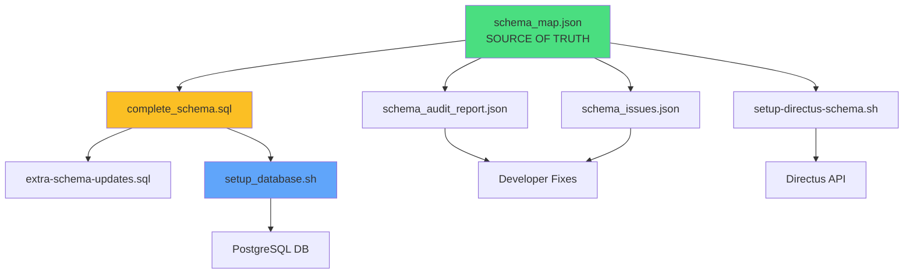

# 📊 COMPLETE SCHEMA DEPENDENCY MATRIX

## File Interconnections Analysis

This document shows how all schema-related files connect and depend on each other.

---

## 🗂️ FILE HIERARCHY

```
spark/
├── GOD_MODE_HARRIS_MATRIX.md        ← Master guide (this doc's companion)
├── schema_map.json                  ← Source of truth (16 collections)
├── schema_issues.json               ← Known problems to fix
├── schema_audit_report.json         ← Complete field validation
├── complete_schema.sql              ← SQL execution script
├── extra-schema-updates.sql         ← Additional migrations
├── setup-directus-schema.sh         ← Automated Directus API setup
└── setup_database.sh                ← Automated PostgreSQL setup
```

---

## 🔄 FILE DEPENDENCY MATRIX

| File | Depends On | Used By | Purpose |
|------|------------|---------|---------|
| `schema_map.json` | ❌ None | ALL | **SOURCE OF TRUTH** - Defines all collections |
| `schema_issues.json` | schema_map.json | Developers | Lists template field  errors |
| `schema_audit_report.json` | schema_map.json | QA/Validation | Field-level validation |
| `complete_schema.sql` | schema_map.json | PostgreSQL | Raw SQL table creation |
| `extra-schema-updates.sql` | complete_schema.sql | PostgreSQL | ALTER statements |
| `setup-directus-schema.sh` | schema_map.json | Directus API | Creates via REST API |
| `setup_database.sh` | complete_schema.sql | Deployment | Automates SSH + SQL |
| `GOD_MODE_HARRIS_MATRIX.md` | ALL above | Humans | Documentation |

---

## 📋 SCHEMA_MAP.JSON: The Source of Truth

**Total Collections:** 16  
**Total Fields:** 94  
**Total Relationships:** 12

### Collection Breakdown

| Collection | Field Count | Has Relations | Batch |
|------------|-------------|---------------|-------|
| sites | 5 | ✅ Yes (10 children) | 1 |
| campaign_masters | 12 | ✅ Yes (3 children) | 1 |
| avatar_intelligence | 6 | ❌ No | 1 |
| avatar_variants | 4 | ❌ No | 1 |
| cartesian_patterns | 4 | ❌ No | 1 |
| geo_intelligence | 3 | ❌ No | 1 |
| offer_blocks | 4 | ❌ No | 1 |
| generated_articles | 15 | ✅ Yes (parent: sites) | 2 |
| generation_jobs | 7 | ✅ Yes (parent: sites) | 2 |
| pages | 8 | ✅ Yes (parent: sites) | 2 |
| posts | 10 | ✅ Yes (parent: sites) | 2 |
| leads | 6 | ✅ Yes (parent: sites) | 2 |
| headline_inventory | 6 | ✅ Yes (parent: campaign_masters) | 2 |
| content_fragments | 6 | ✅ Yes (parent: campaign_masters) | 2 |
| link_targets | 9 | ❌ No (soft reference) | 3 |

---

## 🚨 SCHEMA_ISSUES.JSON: Known Problems

### Issue Summary
- **Total Issues:** 2
- **Type:** Display template field mismatches
- **Severity:** Medium (won't break DB, will break UI)

### Issue Details

#### Issue #1
```json
{
  "collection": "content_fragments",
  "field": "campaign_id",
  "targetCollection": "campaign_masters",
  "templateField": "campaign_name",
  "issue": "Template references non-existent field \"campaign_name\""
}
```

**Root Cause:** `campaign_masters` has field `name`, not `campaign_name`  
**Fix:** Update Directus field meta to use `{{campaign_id.name}}`

#### Issue #2
```json
{
  "collection": "headline_inventory",
  "field": "campaign_id",
  "targetCollection": "campaign_masters",
  "templateField": "campaign_name",
  "issue": "Template references non-existent field \"campaign_name\""
}
```

**Same issue** as above.

---

## 🔍 SCHEMA_AUDIT_REPORT.JSON: Field Validation

**Total Items:** 1,624 lines  
**Total Collections:** 16  
**Total Fields Audited:** 94

### Field Issues Found

| Collection | Field | Issue | Severity |
|------------|-------|-------|----------|
| campaign_masters | site_id | ID field without relational interface | Medium |
| campaign_masters | status | Status field should use select-dropdown | Low |
| content_fragments | campaign_id | ID field without relational interface | Medium |
| generated_articles | campaign_id | ID field without relational interface | Medium |
| generation_jobs | status | Status field should use select-dropdown | Low |
| headline_inventory | campaign_id | ID field without relational interface | Medium |
| headline_inventory | status | Status field should use select-dropdown | Low |

### Pattern Detected
**Problem:** Foreign key fields (UUID type) missing proper Directus interface  
**Impact:** Admin UI won't show dropdown for related records  
**Fix:** Add `"interface": "select-dropdown-m2o"` to field meta

---

## 🗃️ COMPLETE_SCHEMA.SQL: PostgreSQL Implementation

**Total Tables:** 28  
**Total Indexes:** 10  
**Lines of Code:** 376

### Table Creation Order (as written in file)

```sql
-- BATCH 1: Should be first but ISN'T in file
CREATE TABLE headline_inventory ...  -- ❌ WRONG! Depends on campaign_masters
CREATE TABLE content_fragments ...   -- ❌ WRONG! Depends on campaign_masters
CREATE TABLE production_queue ...    -- ❌ WRONG! Depends on sites

-- MISSING FROM FILE:
-- sites
-- campaign_masters  
-- These are REFERENCED but never CREATED!
```

**🚨 CRITICAL FLAW:** This file references `sites` and `campaign_masters` but never creates them!

### Fix Priority

1. Add `CREATE TABLE sites` at the TOP
2. Add `CREATE TABLE campaign_masters` after sites
3. Reorder remaining tables by dependency batch

---

## ⚙️ EXTRA-SCHEMA-UPDATES.SQL: Migrations

**Purpose:** ALTER statements for existing schema  
**Total Operations:** 6

### Operations

1. Add `schema_json` to posts
2. Add `schema_json` to pages
3. Add `schema_json` to generated_articles
4. Add `target_word_count` to campaign_masters
5. Create `link_targets` table
6. Update Directus field interfaces via `directus_fields` table

**Workflow:** Run AFTER `complete_schema.sql`

---

## 🔧 SETUP-DIRECTUS-SCHEMA.SH: API Creation Script

**Method:** Directus REST API  
**Total Collections Created:** 5 (partial, not all 16)  
**Authentication:** Static token (hardcoded)

### Collections Created

1. avatar_intelligence
2. sites  
3. posts
4. pages
5. leads

**Missing:** 11 collections not in this script!

**Recommendation:** Use God-Mode API `/god/schema/snapshot` and `/god/schema/apply` instead

---

## 🚀 SETUP_DATABASE.SH: Automated Deployment

**Method:** SSH + PostgreSQL  
**Dependencies:** complete_schema.sql  
**Target:** Remote server at 72.61.15.216

### Execution Flow

```
1. SCP complete_schema.sql to server
   ↓
2. Find PostgreSQL container
   ↓
3. Copy SQL into container
   ↓
4. Execute: psql -U postgres -d directus -f /tmp/complete_schema.sql
   ↓
5. Verify table count
   ↓
6. Restart Directus container
   ↓
7. Test API authentication
```

**Current Status:** ✅ Script is correct, but `complete_schema.sql` has missing tables

---

## 🔗 CROSS-FILE RELATIONSHIP MAP



---

## ✅ FIX ACTION PLAN

### Phase 1: Fix complete_schema.sql
```sql
-- Add at TOP of file (line 1)
CREATE TABLE sites (
    id UUID PRIMARY KEY DEFAULT gen_random_uuid(),
    name VARCHAR(255) NOT NULL,
    url VARCHAR(500),
    status VARCHAR(50) DEFAULT 'active',
    date_created TIMESTAMP DEFAULT CURRENT_TIMESTAMP
);

CREATE TABLE campaign_masters (
    id UUID PRIMARY KEY DEFAULT gen_random_uuid(),
    site_id UUID REFERENCES sites(id) ON DELETE CASCADE,
    name VARCHAR(255),
    headline_spintax_root TEXT,
    status VARCHAR(50) DEFAULT 'active',
    target_word_count INTEGER DEFAULT 1500,
    date_created TIMESTAMP DEFAULT CURRENT_TIMESTAMP
);
```

### Phase 2: Fix Directus Field Interfaces
```sql
-- Run these UPDATEs in extra-schema-updates.sql
UPDATE directus_fields SET interface = 'select-dropdown-m2o' 
WHERE field IN ('site_id', 'campaign_id') 
AND type = 'uuid';
```

### Phase 3: Fix Template Issues
```javascript
// In Directus UI, update display templates
// FROM: {{campaign_id.campaign_name}}
// TO:   {{campaign_id.name}}
```

### Phase 4: Validate
```bash
# Run complete deployment
./setup_database.sh

# Verify via God-Mode API
curl https://spark.jumpstartscaling.com/god/status \
  -H "X-God-Token: $GOD_MODE_TOKEN"
```

---

## 📊 FINAL FILE DEPENDENCY SUMMARY

**schema_map.json** → Defines the truth  
**schema_issues.json** → Identifies problems  
**schema_audit_report.json** → Validates fields  
**complete_schema.sql** → Executes in PostgreSQL (needs fixes)  
**extra-schema-updates.sql** → Runs migrations  
**setup-directus-schema.sh** → Creates via API (incomplete)  
**setup_database.sh** → Automates deployment  
**GOD_MODE_HARRIS_MATRIX.md** → Human guide  

**All files interconnected. Fix one, test all.**
