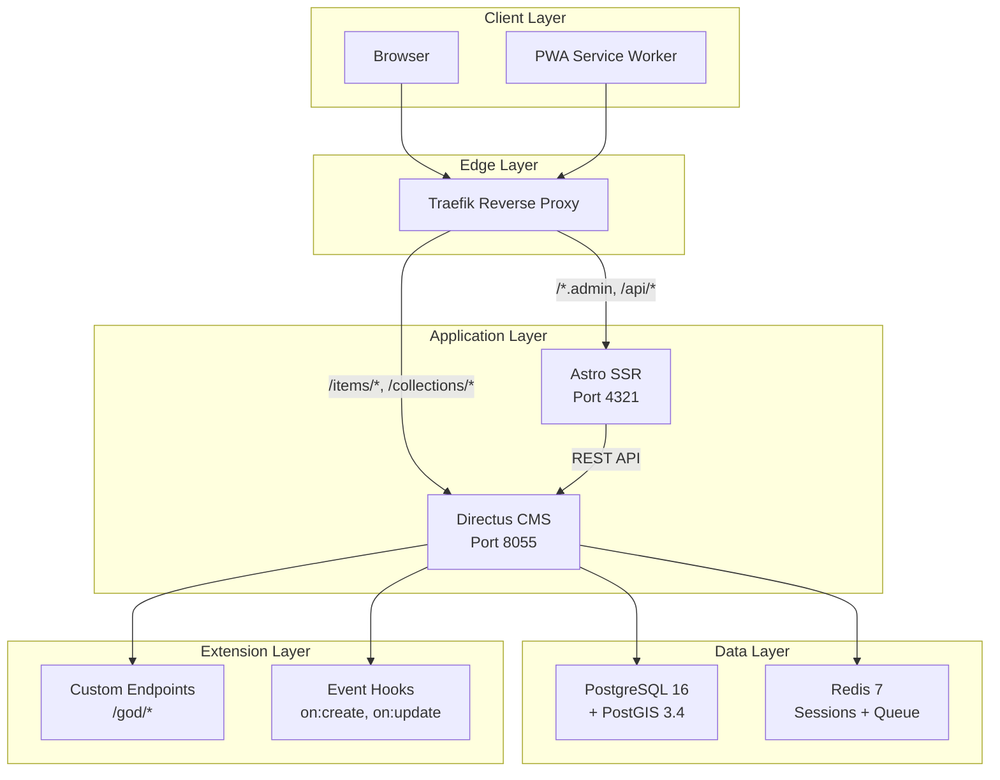

# TECHNICAL ARCHITECTURE: Spark Platform

> **BLUF**: Spark uses Astro SSR + React Islands frontend, Directus headless CMS backend, PostgreSQL with PostGIS for data, and Redis-backed BullMQ for async processing. Multi-tenant via site_id foreign keys.

---

## 1. System Diagram



---

## 2. Component Specifications

### 2.1 Frontend (Astro)

| Property | Value |
|----------|-------|
| Framework | Astro 4.7 |
| Rendering | SSR (Server-Side Rendering) |
| Hydration | Islands Architecture (partial) |
| UI Library | React 18.3 |
| Styling | Tailwind CSS 3.4 |
| State | React Query + Zustand |
| Build | Vite |

**SSR URL Detection Logic**:
```typescript
const isServer = import.meta.env.SSR || typeof window === 'undefined';
const DIRECTUS_URL = isServer 
    ? 'http://directus:8055'      // Docker internal
    : import.meta.env.PUBLIC_DIRECTUS_URL;  // Public HTTPS
```

**Rationale**: Server-side requests use Docker network DNS. Browser requests use public URL.

### 2.2 Backend (Directus)

| Property | Value |
|----------|-------|
| Version | Directus 11 |
| API | REST + GraphQL |
| Auth | JWT + Static Tokens |
| Storage | Local filesystem (uploads volume) |
| Extensions | Endpoints + Hooks |

**Extension Structure**:
```
directus-extensions/
├── endpoints/
│   ├── god-schema/     # Schema operations
│   ├── god-data/       # Bulk data ops
│   └── god-utils/      # Utility endpoints
└── hooks/
    ├── work-log/       # Activity logging
    └── cache-bust/     # Invalidation
```

### 2.3 Database (PostgreSQL)

| Property | Value |
|----------|-------|
| Version | PostgreSQL 16 |
| Extensions | uuid-ossp, pgcrypto, PostGIS 3.4 |
| Collections | 30+ tables |
| Schema Order | Harris Matrix (Foundation → Walls → Roof) |

**Schema Dependency Order**:

| Batch | Tables | Dependencies |
|-------|--------|--------------|
| 1: Foundation | sites, campaign_masters, avatar_*, geo_*, offer_blocks | None |
| 2: Walls | generated_articles, generation_jobs, pages, posts, leads, headline_*, content_* | Batch 1 only |
| 3: Roof | link_targets, globals, navigation | Batch 1-2 |

### 2.4 Cache/Queue (Redis)

| Property | Value |
|----------|-------|
| Version | Redis 7 |
| Mode | Append-only (persistent) |
| Uses | Session cache, BullMQ backing |

**Queue Configuration**:
```typescript
// BullMQ job options
{
    attempts: 3,
    backoff: { type: 'exponential', delay: 1000 },
    removeOnComplete: 100,
    removeOnFail: 1000
}
```

---

## 3. Data Flow

### 3.1 Page Request Flow

```
1. Browser → GET /blog/article-slug
2. Traefik → Route to Frontend (port 4321)
3. Astro SSR → Determine site from domain
4. Astro → GET http://directus:8055/items/posts?filter[slug]=...
5. Directus → PostgreSQL query
6. Directus → Return JSON
7. Astro → Render HTML with React components
8. Astro → Return HTML to browser
9. Browser → Hydrate interactive islands
```

### 3.2 Article Generation Flow

```
1. Admin → POST /api/seo/generate-article
2. Astro API → Create generation_job record
3. Astro API → Queue job in BullMQ
4. BullMQ Worker → Dequeue job
5. Worker → Fetch campaign config from Directus
6. Worker → Compute Cartesian products
7. Worker → For each permutation:
    a. Replace tokens
    b. Process spintax
    c. Generate SEO meta
    d. Create generated_articles record
8. Worker → Update job status: completed
9. Admin → Kanban reflects new articles
```

### 3.3 Multi-Tenant Request Isolation

```
1. Request → https://client-a.example.com/page
2. Middleware → Extract hostname
3. Middleware → Query sites WHERE url LIKE %hostname%
4. Middleware → Set site_id in context
5. All queries → Filter by site_id
6. Response → Only tenant data returned
```

---

## 4. API Surface

### 4.1 Public Endpoints

| Endpoint | Method | Purpose |
|----------|--------|---------|
| `/api/lead` | POST | Form submission |
| `/api/forms/submit` | POST | Generic form handler |
| `/api/track/pageview` | POST | Analytics |
| `/api/track/event` | POST | Custom events |
| `/api/track/conversion` | POST | Conversion recording |

### 4.2 Admin Endpoints

| Endpoint | Method | Auth | Purpose |
|----------|--------|------|---------|
| `/api/seo/generate-headlines` | POST | Token | Spintax permutation |
| `/api/seo/generate-article` | POST | Token | Article creation |
| `/api/seo/approve-batch` | POST | Token | Bulk approval |
| `/api/seo/publish-article` | POST | Token | Single publish |
| `/api/seo/scan-duplicates` | POST | Token | Duplicate detection |
| `/api/seo/insert-links` | POST | Token | Internal linking |
| `/api/seo/process-queue` | POST | Token | Queue advancement |
| `/api/campaigns` | GET/POST | Token | Campaign CRUD |
| `/api/admin/import-blueprint` | POST | Token | Site import |
| `/api/admin/worklog` | GET | Token | Activity log |

### 4.3 God-Mode Endpoints

| Endpoint | Method | Header | Purpose |
|----------|--------|--------|---------|
| `/god/schema/collections/create` | POST | X-God-Token | Create collection |
| `/god/schema/relations/create` | POST | X-God-Token | Create relation |
| `/god/schema/snapshot` | GET | X-God-Token | Export schema YAML |
| `/god/data/bulk-insert` | POST | X-God-Token | Mass data insert |

---

## 5. Authentication Model

### 5.1 Directus Auth

| Method | Use Case |
|--------|----------|
| JWT | User login sessions |
| Static Token | API integrations |
| God-Mode Token | Administrative operations |

### 5.2 Token Hierarchy

```
┌─────────────────────────────────────┐
│  GOD_MODE_TOKEN                     │  ← Full schema access
│  X-God-Token header                 │
└─────────────────────────────────────┘
                ▼
┌─────────────────────────────────────┐
│  DIRECTUS_ADMIN_TOKEN              │  ← All collections CRUD
│  Authorization: Bearer              │
└─────────────────────────────────────┘
                ▼
┌─────────────────────────────────────┐
│  Site-Scoped Token                 │  ← Single site access
│  Generated per tenant              │
└─────────────────────────────────────┘
                ▼
┌─────────────────────────────────────┐
│  Public Access                     │  ← Read-only published
│  No token required                 │
└─────────────────────────────────────┘
```

---

## 6. Security Configuration

### 6.1 CORS Policy

```yaml
CORS_ORIGIN: 'https://spark.jumpstartscaling.com,https://launch.jumpstartscaling.com,http://localhost:4321'
CORS_ENABLED: 'true'
```

### 6.2 Rate Limiting

```yaml
RATE_LIMITER_ENABLED: 'false'  # Disabled for internal use
```

### 6.3 Payload Limits

```yaml
MAX_PAYLOAD_SIZE: '500mb'  # Large batch operations
```

---

## 7. Deployment Configuration

### 7.1 Docker Compose Services

| Service | Image | Port | Volume |
|---------|-------|------|--------|
| postgresql | postgis/postgis:16-3.4-alpine | 5432 | postgres-data-fresh |
| redis | redis:7-alpine | 6379 | redis-data |
| directus | directus/directus:11 | 8055 | directus-uploads |
| frontend | Built from Dockerfile | 4321 | None |

### 7.2 Environment Variables

| Variable | Purpose | Where Set |
|----------|---------|-----------|
| PUBLIC_DIRECTUS_URL | Client-side API URL | docker-compose.yaml |
| DIRECTUS_ADMIN_TOKEN | SSR API auth | Coolify secrets |
| GOD_MODE_TOKEN | Schema operations | Coolify secrets |
| FORCE_FRESH_INSTALL | Wipe + rebuild schema | Coolify secrets |
| CORS_ORIGIN | Allowed origins | docker-compose.yaml |

### 7.3 Coolify Labels

```yaml
labels:
    coolify.managed: 'true'
    coolify.name: 'directus'
    coolify.fqdn: 'spark.jumpstartscaling.com'
    coolify.port: '8055'
```

---

## 8. Extension Points

### 8.1 Adding New Collections

1. Define in `complete_schema.sql` (Harris Matrix order)
2. Add TypeScript interface to `schemas.ts`
3. Create API endpoint if needed
4. Add admin page component

### 8.2 Adding New Blocks

1. Create component in `frontend/src/components/blocks/`
2. Register in `BlockRenderer.tsx` switch statement
3. Add schema to Page Builder config

### 8.3 Adding New Endpoints

1. Create file in `frontend/src/pages/api/`
2. Export async handler function
3. Add to API_REFERENCE.md

### 8.4 Adding Custom Directus Extensions

1. Create in `directus-extensions/endpoints/` or `hooks/`
2. Restart Directus container
3. Extensions auto-load from mounted volume

---

## 9. Performance Considerations

### 9.1 SSR Caching

| Strategy | Implementation |
|----------|----------------|
| ISR | Not used (dynamic content) |
| Edge Cache | Traefik level (CDN potential) |
| API Cache | Redis TTL on queries |

### 9.2 Database Optimization

| Technique | Application |
|------------|-------------|
| Indexes | FK columns, status, slug |
| Pagination | Offset-based with limits |
| Field Selection | Only request needed fields |

### 9.3 Bundle Optimization

| Technique | Implementation |
|-----------|----------------|
| Islands | Only hydrate interactive components |
| Code Splitting | Vite automatic chunks |
| Compression | Brotli via Astro adapter |

---

## 10. Monitoring & Logging

### 10.1 Log Locations

| Service | Location |
|---------|----------|
| Directus | Container stdout (Coolify UI) |
| Frontend | Container stdout (Coolify UI) |
| PostgreSQL | Container stdout |

### 10.2 Health Checks

| Service | Endpoint | Interval |
|---------|----------|----------|
| PostgreSQL | pg_isready | 5s |
| Redis | redis-cli ping | 5s |
| Directus | /server/health | 10s |

### 10.3 Work Log Table

```sql
SELECT * FROM work_log 
ORDER BY timestamp DESC 
LIMIT 100;
```

Fields: action, entity_type, entity_id, details, level, user, timestamp
